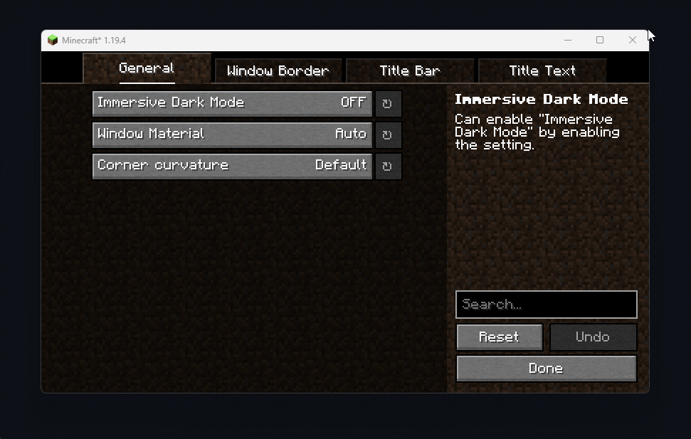

# Mica

### Enable Mica or Acrylic on Windows 11 21H2 (Build 22000) or later.

### Required Mods
- **[YetAnotherConfigLib](https://modrinth.com/mod/yacl)**: Required for setting changes.

### Preview

